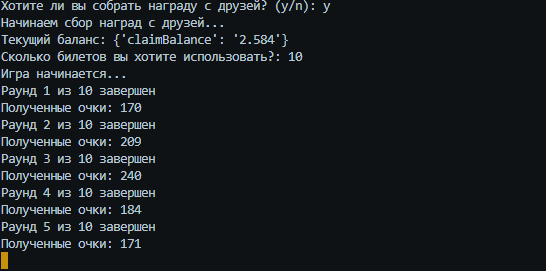

### Автоматический скрипт Blum с использованием API 👾🔗 
  
Скрипт создан исключительно для развлекательных целей, и я никого не принуждаю его использовать!

   

## История:
- Достаточно давно я создал первый скрипт на Blum, этот скрипт был простым кликером, здесь же все реализовано с помощью API и bearer токена.

## О проекте:
### В проекте используются
- <code>Python 3.9.10</code>, библиотеки: <code>requests</code>, <code>json</code>, <code>time</code>, <code>random</code>

## Установка
### Существует три способа установки и использования скрипта:
1.  Воспользуйтесь файлом `installer.cmd`, он установит все за вас, воспользуйтесь файлом `blum.cmd`, или `main.py` для запуска скрипта. 
2.  Самый простой способ, воспользуйтесь файлом `blum.exe`, ничего устанавливать не потребуется.
3.  Третий способ, установите все необходимые зависимости вручную, следующим образом: `pip install -r requirements.txt`.

- Перемещать все файлы, кроме `blum.exe` категорически не рекомендуется.

